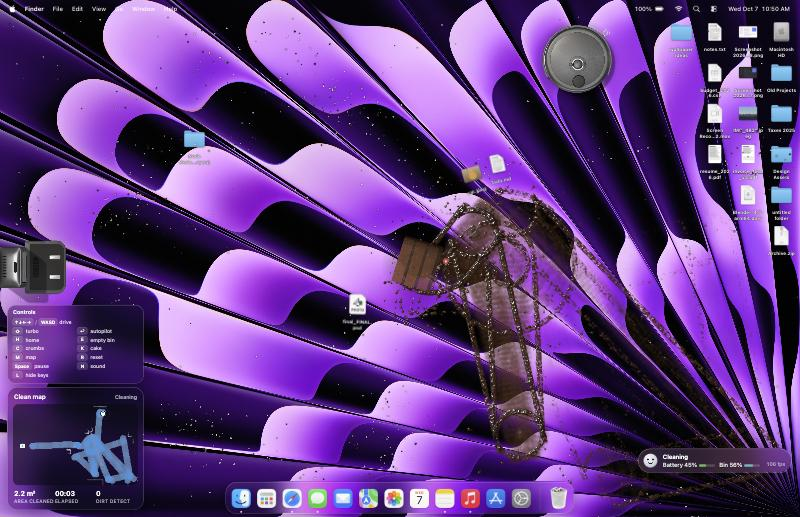
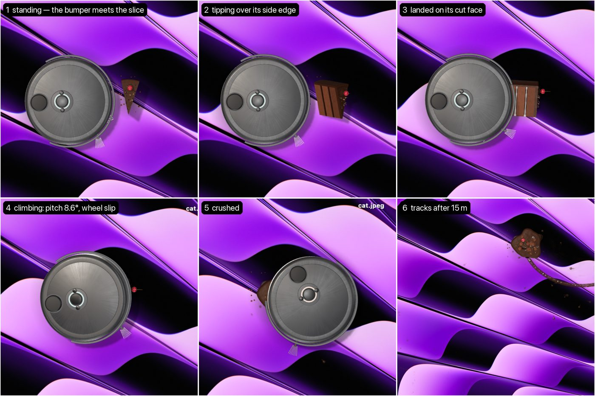

# Desktop Roomba

A robot vacuum for your desktop. Your files are furniture now.

It runs in the browser on a pixel-faithful macOS desktop. The robot cleans the way a real one does: spirals, wall-following, bumping, getting stuck, mapping the room, driving home to empty its bin. There is also a slice of chocolate cake in the middle of the desktop. You know how this ends.

**Play it: https://deskroomba.vercel.app**



## Controls

| Key | What it does |
|---|---|
| Arrows / WASD | Take the remote and drive it yourself |
| Shift | Turbo (the motor's real top speed) |
| Enter | Hand it back to the autopilot (it also takes over after 4 s idle) |
| H | Send it home to the dock |
| E | Empty the bin now |
| C | Drop crumbs under the cursor |
| K | Put a new slice of cake on a plate under the cursor |
| M | Cycle the clean map: corner card, full screen, off |
| R | Reset everything, including the mess |
| Space | Pause |
| N | Sound on or off |
| L | Show or hide the controls card |

Drag any desktop icon to build walls, free a stuck robot or trap it on purpose. Click once to enable sound.

URL options: `?nohud` hides every overlay for recording, `?seed=N` picks a different run, `?battery=MINUTES` sets the battery life (default 4 so docking happens often).

## Everything is physics

Nothing is scripted. The behaviour comes out of the simulation.

- **Drive.** Rapier2D rigid bodies. Each wheel pushes with a force limited by the motor curve and by tyre friction, so the robot slows down and its wheels spin when it pushes something heavy.
- **Files have mass.** An icon's mass comes from the file's size, from 20 g for an empty file to 320 g for anything over 1 GB. The robot can shove every file, and the big ones push back harder. Icons stick and slip with static and kinetic friction.
- **Sensors.** Bumper halves, cliff sensors at the screen edges, side and front IR range sensors. The robot only knows what its sensors told it. The map in the corner is built from bumps and IR hits, not from the page layout.
- **Behaviours.** Modelled on classic robot vacuums: outward spiral, bounce, wall-following, spot cleaning on dirty patches, an escape ladder when trapped, then giving up with a red light. A* back to the dock over its own map, then emptying and charging.
- **Dust.** Particles the suction pulls in and the side brush flings around before they are collected.
- **The cake.** A 0.35 kg slice stands on a 0.45 kg ceramic plate that slides easily on the desk. A gentle push moves the plate and the slice stays up. A hard ram, or slamming the plate into something, tips the slice: its inertia beats its weight on the narrow base, and it falls as a rigid body about its edge, onto the plate or off it. Lying down it becomes a crushable sponge grid. The robot rolls over it on spring-loaded wheels with a small hop and loses some grip in the frosting. A few passes crush it. Frosting moves onto each tyre and the brush, then prints back onto the desktop and wears off with distance.



## Run it locally

```bash
npm install
npm run dev
```

Then open http://localhost:5174. `npm run test:sim` runs the headless physics test suite.

## How it's built

- `src/sim/`: the simulation. Rapier2D, no DOM, deterministic per seed, about 0.04 ms per step.
- `src/desktop/`: the fake macOS desktop in plain DOM and CSS, with Liquid Glass menu bar and Dock.
- `src/render/`: three.js for the robot, dock, cake and plate, a WebGL paint layer for the smear, WebAudio for the sound (filtered noise only).
- `blender/`: Python scripts that build the robot, dock and cake models procedurally and export glTF.
- `scripts/`: the desktop asset scanner and the fake-desktop generator.

## Credits and disclaimer

Made by Alan Podemski, built with Claude Code. Inspired by [@terkelg](https://x.com/terkelg)'s desktop rug.

This is a fan project for fun. It is not affiliated with or endorsed by Apple or iRobot. macOS, the macOS wallpaper and Apple app icons are trademarks and property of Apple Inc. Roomba is a trademark of iRobot. The robot model here is generic and unbranded.

The code is MIT licensed. See [LICENSE](LICENSE).
